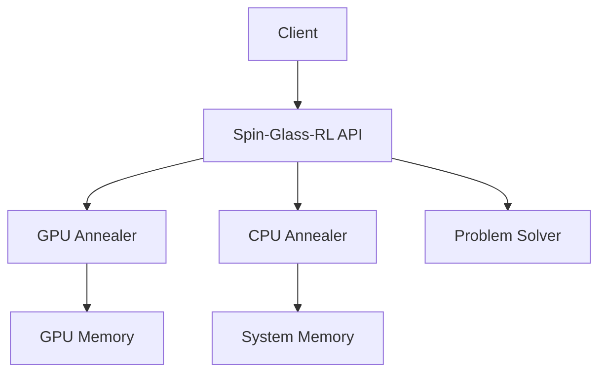
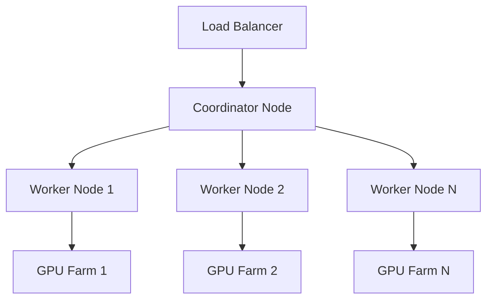

# Spin-Glass-Anneal-RL Deployment Guide

This guide provides comprehensive instructions for deploying Spin-Glass-Anneal-RL in production environments.

## 📋 Prerequisites

### System Requirements

**Minimum:**
- **CPU**: 4 cores, 2.5+ GHz
- **RAM**: 8 GB
- **Storage**: 50 GB available space
- **OS**: Linux (Ubuntu 20.04+), macOS 10.15+, Windows 10+
- **Python**: 3.9+

**Recommended for Production:**
- **CPU**: 16+ cores, 3.0+ GHz
- **RAM**: 32+ GB
- **Storage**: 500+ GB SSD
- **GPU**: NVIDIA GPU with CUDA 12.0+ (optional but highly recommended)
- **Network**: Gigabit Ethernet for distributed deployments

### Dependencies

**Core Dependencies:**
```bash
numpy>=1.24.0
torch>=2.0.0
scipy>=1.10.0
networkx>=3.0
```

**Optional Performance Dependencies:**
```bash
cupy-cuda12x>=12.0.0  # For GPU acceleration
psutil>=5.9.0         # For system monitoring
```

## 🚀 Installation Methods

### Method 1: pip Installation (Recommended)

```bash
# Basic installation
pip install spin-glass-anneal-rl

# With GPU support
pip install spin-glass-anneal-rl[cuda]

# Full installation with all features
pip install spin-glass-anneal-rl[all]
```

### Method 2: Docker Deployment

```bash
# Pull the official image
docker pull terragonlabs/spin-glass-anneal-rl:latest

# Run with GPU support
docker run --gpus all -p 8888:8888 terragonlabs/spin-glass-anneal-rl:latest

# Run with custom configuration
docker run -v /path/to/config:/app/config \
           -p 8888:8888 \
           terragonlabs/spin-glass-anneal-rl:latest
```

### Method 3: Kubernetes Deployment

```yaml
# Use the provided k8s manifests
kubectl apply -f deployment/k8s/
```

### Method 4: From Source

```bash
git clone https://github.com/terragonlabs/spin-glass-anneal-rl.git
cd spin-glass-anneal-rl
pip install -e ".[dev]"
```

## ⚙️ Configuration

### Environment Variables

```bash
# Core Configuration
export SPIN_GLASS_LOG_LEVEL=INFO
export SPIN_GLASS_LOG_FILE=/var/log/spin-glass-rl.log
export SPIN_GLASS_CONFIG_DIR=/etc/spin-glass-rl

# Performance Settings
export SPIN_GLASS_CUDA_DEVICE=0
export SPIN_GLASS_MEMORY_LIMIT=8GB
export SPIN_GLASS_BATCH_SIZE=32

# Security Settings
export SPIN_GLASS_SECURITY_MODE=strict
export SPIN_GLASS_AUTH_TOKEN=your-secure-token

# Distributed Settings
export SPIN_GLASS_COORDINATOR_HOST=localhost
export SPIN_GLASS_COORDINATOR_PORT=8888
export SPIN_GLASS_WORKER_CAPABILITIES="annealing,optimization"
```

### Configuration Files

**Main Configuration (`/etc/spin-glass-rl/config.yaml`):**

```yaml
# Core settings
core:
  log_level: INFO
  temp_dir: /tmp/spin-glass-rl
  max_workers: 8

# Annealing settings
annealing:
  default_sweeps: 10000
  initial_temp: 5.0
  final_temp: 0.01
  schedule_type: geometric
  
# GPU settings
gpu:
  enabled: true
  devices: [0, 1]  # GPU device IDs
  memory_fraction: 0.8
  
# Performance settings
performance:
  cache_size_mb: 1000
  batch_size: 32
  parallel_processing: true
  
# Security settings
security:
  enabled: true
  max_file_size_mb: 100
  allowed_extensions: ['.json', '.yaml', '.npy']
  
# Monitoring settings
monitoring:
  health_check_interval: 30
  metrics_collection: true
  prometheus_port: 9090
```

## 🏗️ Deployment Architectures

### Single Node Deployment



**Use Case:** Development, small-scale problems, proof of concept

**Setup:**
```bash
# Install and configure
pip install spin-glass-anneal-rl[cuda]
export SPIN_GLASS_CONFIG_DIR=/opt/spin-glass-rl/config
spin-glass-rl serve --host 0.0.0.0 --port 8888
```

### Multi-Node Cluster



**Use Case:** Large-scale optimization, high availability, production workloads

**Coordinator Setup:**
```bash
# On coordinator node
spin-glass-rl coordinator start \
    --host 0.0.0.0 \
    --port 8888 \
    --workers-config /etc/spin-glass-rl/workers.yaml
```

**Worker Setup:**
```bash
# On each worker node
spin-glass-rl worker start \
    --coordinator-host coordinator.example.com \
    --coordinator-port 8888 \
    --capabilities annealing,optimization \
    --gpu-devices 0,1,2,3
```

### Cloud Deployment (AWS/Azure/GCP)

**AWS EKS Deployment:**
```bash
# Create EKS cluster
eksctl create cluster --name spin-glass-cluster --region us-west-2

# Deploy application
kubectl apply -f deployment/aws/eks/
```

**Azure AKS Deployment:**
```bash
# Create AKS cluster
az aks create --resource-group rg-spin-glass --name spin-glass-cluster

# Deploy application
kubectl apply -f deployment/azure/aks/
```

## 🛡️ Security Configuration

### Authentication & Authorization

```yaml
security:
  auth:
    enabled: true
    method: jwt  # jwt, api_key, oauth
    secret_key: ${SPIN_GLASS_JWT_SECRET}
    token_expiry: 3600
    
  authorization:
    enabled: true
    roles:
      - name: admin
        permissions: [read, write, execute, admin]
      - name: user
        permissions: [read, execute]
      - name: readonly
        permissions: [read]
```

### TLS/SSL Configuration

```yaml
tls:
  enabled: true
  cert_file: /etc/ssl/certs/spin-glass-rl.crt
  key_file: /etc/ssl/private/spin-glass-rl.key
  ca_file: /etc/ssl/certs/ca.crt
```

### Network Security

```yaml
network:
  allowed_hosts:
    - "*.example.com"
    - "10.0.0.0/8"
    - "192.168.0.0/16"
  
  rate_limiting:
    enabled: true
    requests_per_minute: 100
    burst_size: 20
```

## 📊 Monitoring & Observability

### Health Checks

**Kubernetes Liveness Probe:**
```yaml
livenessProbe:
  httpGet:
    path: /health
    port: 8888
  initialDelaySeconds: 30
  periodSeconds: 10
```

**Manual Health Check:**
```bash
curl http://localhost:8888/health
```

### Metrics Collection

**Prometheus Configuration:**
```yaml
global:
  scrape_interval: 15s

scrape_configs:
  - job_name: 'spin-glass-rl'
    static_configs:
      - targets: ['localhost:9090']
```

**Grafana Dashboard:** Import dashboard from `deployment/monitoring/grafana-dashboard.json`

### Logging

**Structured Logging Configuration:**
```yaml
logging:
  format: json
  level: INFO
  handlers:
    - type: file
      filename: /var/log/spin-glass-rl/app.log
      max_size: 100MB
      backup_count: 5
    - type: syslog
      facility: local0
```

**Log Aggregation (ELK Stack):**
```yaml
# filebeat.yml
filebeat.inputs:
- type: log
  paths:
    - /var/log/spin-glass-rl/*.log
  fields:
    service: spin-glass-rl
```

## 🔄 CI/CD Pipeline

### GitHub Actions Workflow

```yaml
# .github/workflows/deploy.yml
name: Deploy to Production

on:
  push:
    branches: [main]
    tags: ['v*']

jobs:
  test:
    runs-on: ubuntu-latest
    steps:
      - uses: actions/checkout@v3
      - name: Run tests
        run: |
          pip install -e ".[dev]"
          pytest tests/ --cov=spin_glass_rl
  
  security-scan:
    runs-on: ubuntu-latest
    steps:
      - uses: actions/checkout@v3
      - name: Security scan
        run: python3 security_scan.py
  
  build-and-deploy:
    needs: [test, security-scan]
    runs-on: ubuntu-latest
    steps:
      - name: Build Docker image
        run: |
          docker build -t spin-glass-rl:${{ github.sha }} .
          docker push terragonlabs/spin-glass-rl:${{ github.sha }}
      
      - name: Deploy to Kubernetes
        run: |
          kubectl set image deployment/spin-glass-rl \
            spin-glass-rl=terragonlabs/spin-glass-rl:${{ github.sha }}
```

## 🚨 Troubleshooting

### Common Issues

**Issue 1: CUDA Out of Memory**
```bash
# Solution: Reduce batch size or enable memory optimization
export SPIN_GLASS_BATCH_SIZE=16
export SPIN_GLASS_MEMORY_OPTIMIZATION=aggressive
```

**Issue 2: Worker Connection Timeout**
```bash
# Solution: Check network connectivity and firewall
telnet coordinator-host 8888
netstat -tlnp | grep 8888
```

**Issue 3: Poor Performance**
```bash
# Solution: Enable performance profiling
export SPIN_GLASS_PROFILING=true
spin-glass-rl profile-report
```

### Debug Mode

```bash
# Enable debug logging
export SPIN_GLASS_LOG_LEVEL=DEBUG
export SPIN_GLASS_DEBUG=true

# Run with verbose output
spin-glass-rl --verbose solve problem.json
```

### Log Analysis

```bash
# Check recent errors
tail -f /var/log/spin-glass-rl.log | grep ERROR

# Analyze performance metrics
spin-glass-rl analyze-logs --input /var/log/spin-glass-rl.log \
                          --output performance-report.html
```

## 📈 Performance Tuning

### GPU Optimization

```yaml
gpu:
  # Use multiple GPUs
  devices: [0, 1, 2, 3]
  
  # Optimize memory usage
  memory_pool_size: 2GB
  cache_size: 500MB
  
  # Kernel optimization
  block_size: 256
  grid_size: auto
```

### CPU Optimization

```yaml
cpu:
  # Worker threads
  num_workers: 16
  
  # Memory optimization
  memory_limit: 16GB
  cache_size: 2GB
  
  # NUMA optimization
  affinity: true
```

### Network Optimization

```yaml
network:
  # Connection pooling
  pool_size: 100
  keepalive: 60
  
  # Compression
  compression: gzip
  
  # Batch processing
  batch_size: 1000
```

## 🔧 Maintenance

### Regular Tasks

**Daily:**
- Check system health
- Review error logs
- Monitor resource usage

**Weekly:**
- Update dependencies
- Clean temporary files
- Backup configurations

**Monthly:**
- Security updates
- Performance review
- Capacity planning

### Backup Strategy

```bash
# Configuration backup
tar -czf config-backup-$(date +%Y%m%d).tar.gz /etc/spin-glass-rl/

# Data backup
spin-glass-rl export-data --output data-backup-$(date +%Y%m%d).tar.gz

# Database backup (if applicable)
pg_dump spin_glass_rl > db-backup-$(date +%Y%m%d).sql
```

### Update Procedure

```bash
# 1. Backup current installation
cp -r /opt/spin-glass-rl /opt/spin-glass-rl.backup

# 2. Update package
pip install --upgrade spin-glass-anneal-rl

# 3. Update configuration if needed
spin-glass-rl migrate-config --from 1.0 --to 2.0

# 4. Restart services
systemctl restart spin-glass-rl

# 5. Verify deployment
spin-glass-rl health-check
```

## 📞 Support

- **Documentation**: https://spin-glass-anneal-rl.readthedocs.io
- **Issues**: https://github.com/terragonlabs/spin-glass-anneal-rl/issues
- **Discord**: https://discord.gg/spin-glass-rl
- **Email**: support@terragonlabs.com

---

*For advanced deployment scenarios or enterprise support, contact Terragon Labs.*